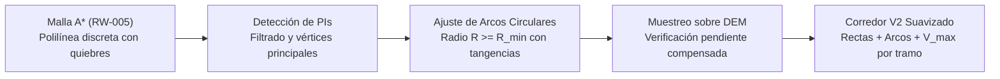

# Geometría de curvas ferroviarias, radio mínimo y trazado horizontal

## Question

¿Cuáles son las leyes físicas, límites normativos (RITO/NTVO y estándares internacionales EN 13803 / UIC / AREMA) y criterios de diseño geométrico que gobiernan el trazado en curva de una vía férrea según trocha y velocidad, y cómo debe modelarse en `RailWeaver.Core` la transformación del corredor poligonal discreto (RW-005) en un alineamiento continuo de rectas y arcos circulares con radio mínimo garantizado (V0.7), preparando además el cálculo de velocidad admisible para RW-008?

## Sources

- **Reglamento Interno Técnico Operativo (RITO)**, Ferrocarriles Argentinos / Comisión Nacional de Regulación del Transporte (CNRT). Artículos sobre velocidades máximas en curva, limitaciones de marcha por estado de vía y restricciones de empalmes y desvíos.
- **Normas Técnicas de Vía y Obras (NTVO)** y especificaciones de ADIFSE (Trenes Argentinos Infraestructura) / FIUBA. Parámetros de diseño geométrico en planta para trocha ancha ($1.676\text{ mm}$) y trocha métrica ($1.000\text{ mm}$): peraltes máximos admisibles, insuficiencia de peralte, radios mínimos excepcionales y normales, y longitudes de transición.
- **Comité Europeo de Normalización (CEN)**, *EN 13803: Railway applications - Track - Track alignment design parameters - Track gauges 1435 mm and wider* (y directrices asociadas para vía estrecha). Formulaciones de aceleración lateral residual, variación de aceleración en el tiempo (*jerk* o tirón) y deficiencia de peralte.
- **Union Internationale des Chemins de fer (UIC)**, *UIC Leaflet 703: Layout characteristics for lines used by new passenger and freight trains*. Criterios de radios en función de la velocidad y compatibilidad de tráfico mixto.
- **American Railway Engineering and Maintenance-of-Way Association (AREMA)**, *Manual for Railway Engineering*, Capítulo 5 (*Track*) y Capítulo 16 (*Economics of Railway Location and Operation*). Fórmulas de grado de curva ($D^\circ$), sobreelevación (*superelevation*), deficiencia de sobreelevación y compensación de pendiente por curvatura (*curve compensation*).
- **López Pita, A.** (2006), *Infraestructuras Ferroviarias: Esquemas Técnicos y de Funcionamiento*, Edicions UPC; y **Oliveros Rives, F. et al.** (1980), *Tratado de Ferrocarriles*. Principios cinemáticos de la interacción rueda-carril en curva, resistencia adicional por curvatura (fórmulas de Desdouits y Von Röckl) y diseño de acuerdos horizontales.
- **RailWeaver Project Kickoff** (§7 *Fidelidad de terreno V2: Trazado en rectas y arcos con radio mínimo*, §15 *Route / Tramo Generator*, §39 *V0.7 Curvature*).
- **RailWeaver Backlog** (`docs/specs/backlog/RW-007-curvature.md`).

---

## Real-world behavior

### 1. Física de la circulación en curva

Cuando un vehículo ferroviario recorre una curva circular de radio $R$ (en metros) a una velocidad constante $v$ (en $\text{m/s}$), o $V$ (en $\text{km/h}$), sus masas están sujetas a una aceleración centrífuga radial orientada hacia el exterior de la curva:

$$a_c = \frac{v^2}{R} = \frac{V^2}{3{,}6^2 \cdot R} \approx \frac{V^2}{12{,}96 \cdot R}$$

Si la vía fuera perfectamente plana (ambos rieles a la misma cota transversal), esta aceleración centrífuga generaría:
1. Una fuerza lateral no compensada sobre los pasajeros y la carga, afectando severamente el confort y la estabilidad.
2. Un empuje lateral violento de las pestañas de las ruedas exteriores contra el hongo del riel exterior, provocando desgaste prematuro, riesgo de remontamiento de pestaña (*wheel climb derailment*) y esfuerzos transversales desmedidos sobre las fijaciones y durmientes.

### 2. Peralte y peralte de equilibrio

Para contrarrestar la aceleración centrífuga, la vía se inclina transversalmente elevando el riel exterior respecto al riel interior en una magnitud $h$ (medida en milímetros), denominada **peralte** (*cant* o *superelevation*).

Al elevar el riel exterior, la fuerza peso del vehículo se descompone, generando una componente transversal hacia el interior de la curva que compensa parcial o totalmente la fuerza centrífuga:

$$\gamma = \frac{h}{s}$$

donde $s$ es la distancia entre los ejes de apoyo de las ruedas sobre los hongos de los rieles (ancho de vía eficaz o trocha entre ejes de contacto):
- Para **trocha ancha** ($1.676\text{ mm}$): $s \approx 1.740\text{ mm}$.
- Para **trocha media / estándar** ($1.435\text{ mm}$): $s \approx 1.500\text{ mm}$.
- Para **trocha métrica** ($1.000\text{ mm}$): $s \approx 1.060\text{ mm}$.

La aceleración transversal compensada por el peralte es:

$$a_h = g \cdot \frac{h}{s}$$

El **peralte de equilibrio teórico** ($h_{eq}$) es aquel en el cual la componente gravitatoria compensa de manera exacta a la aceleración centrífuga ($a_h = a_c$), de modo que el tren no experimenta ninguna fuerza lateral neta:

$$g \cdot \frac{h_{eq}}{s} = \frac{V^2}{12{,}96 \cdot R} \implies h_{eq} = \left(\frac{s}{12{,}96 \cdot g}\right) \cdot \frac{V^2}{R} = K \cdot \frac{V^2}{R}$$

Donde la constante cinemática $K = \frac{s}{12{,}96 \cdot 9{,}80665} \approx \frac{s}{127{,}1}$ toma los siguientes valores según la trocha:

| Trocha nominal | Ancho de apoyo eficaz ($s$) | Constante cinemática ($K$) | Fórmula de peralte de equilibrio ($h_{eq}$ en mm, $V$ en km/h, $R$ en m) |
|---|---|---|---|
| **Métrica ($1.000\text{ mm}$)** (ej. Ramal A1 Tren de las Sierras) | $1.060\text{ mm}$ | $\mathbf{8{,}34}$ | $h_{eq} = 8{,}34 \cdot \frac{V^2}{R}$ |
| **Estándar ($1.435\text{ mm}$)** (referencia internacional) | $1.500\text{ mm}$ | $\mathbf{11{,}80}$ | $h_{eq} = 11{,}80 \cdot \frac{V^2}{R}$ |
| **Ancha ($1.676\text{ mm}$)** (ej. Ferrocarril Mitre de Córdoba) | $1.740\text{ mm}$ | $\mathbf{13{,}69}$ | $h_{eq} = 13{,}69 \cdot \frac{V^2}{R}$ |

### 3. Tráfico mixto, peralte práctico e insuficiencia de peralte

En una vía férrea de uso general no circula un único tipo de tren a una única velocidad:
- Circulan **trenes de carga pesados y lentos** (ej. $30\text{ a }60\text{ km/h}$).
- Circulan **trenes de pasajeros más rápidos** (ej. $80\text{ a }120\text{ km/h}$).

Si la vía se construyera con el peralte de equilibrio del tren de pasajeros rápido:
- Un tren de carga lento o un tren detenido en la curva sufriría un **exceso de peralte** ($E = h - h_{eq}$): el peso volcaría hacia el riel interior bajo, aplastándolo y aumentando el riesgo de desgaste por aplastamiento o vuelco estático con viento lateral.
- Por ello existe un **límite superior de peralte práctico ($h_{\max}$)**, fijado habitualmente en:
  - Trocha ancha: $h_{\max} = 140\text{ mm}$ (excepcional hasta $160\text{ mm}$).
  - Trocha métrica: $h_{\max} = 90\text{ mm}$ (excepcional hasta $100\text{ mm}$).

Dado que $h$ no puede crecer indefinidamente para satisfacer la velocidad del tren rápido, este circula con un peralte inferior al de equilibrio. Esta diferencia se define como **insuficiencia o deficiencia de peralte** ($I$ o *cant deficiency*):

$$I = h_{eq} - h$$

La aceleración lateral neta no compensada que sienten los pasajeros y el material rodante es directamente proporcional a $I$:

$$a_{nc} = g \cdot \frac{I}{s} = \frac{I}{K \cdot 12{,}96}$$

Los reglamentos ferroviarios fijan un límite estricto de **insuficiencia de peralte máxima ($I_{\max}$)** para garantizar la seguridad contra descarrilamiento y el confort:
- Trocha ancha: $I_{\max} = 100\text{ mm}$ (normal) a $130\text{ mm}$ (admisible material convencional), excepcional $150\text{ mm}$. Corresponde a $a_{nc} \le 0{,}65\text{ a }0{,}85\text{ m/s}^2$.
- Trocha métrica: $I_{\max} = 60\text{ mm}$ (normal) a $80\text{ mm}$ (admisible). Corresponde a $a_{nc} \le 0{,}55\text{ a }0{,}75\text{ m/s}^2$.

### 4. Relación entre radio de curva, peralte y velocidad máxima admisible

Combinando las ecuaciones anteriores, la velocidad máxima admisible $V_{\max}$ ($\text{km/h}$) en una curva circular de radio $R$ (metros) dotada de un peralte $h$ (mm) con una insuficiencia de peralte tolerada $I$ (mm) es:

$$V_{\max} = \sqrt{\frac{R \cdot (h + I)}{K}}$$

Y recíprocamente, para una velocidad de diseño de proyecto $V_d$, el **radio mínimo absoluto ($R_{\min}$)** admisible para no superar los límites físicos y normativos es:

$$R_{\min} = K \cdot \frac{V_d^2}{h_{\max} + I_{\max}}$$

#### Valores normativos de referencia (Argentina y comparativa)

| Trocha | Entorno / Tipo de línea | Velocidad de diseño ($V_d$) | $h_{\max} + I_{\max}$ | Radio mínimo de proyecto ($R_{\min}$) | Radio excepcional / restringido |
|---|---|---|---|---|---|
| **Ancha ($1.676\text{ mm}$)** | Troncal llanura (cargas y pasajeros) | $100\text{ a }120\text{ km/h}$ | $140 + 100 = 240\text{ mm}$ | $\mathbf{800\text{ m} - 1.000\text{ m}}$ | $500\text{ m} - 600\text{ m}$ (a vel. reducida) |
| **Ancha ($1.676\text{ mm}$)** | Mixto convencional / regional | $70\text{ a }90\text{ km/h}$ | $140 + 100 = 240\text{ mm}$ | $\mathbf{400\text{ m} - 550\text{ m}}$ | $300\text{ m}$ ($V \le 65\text{ km/h}$) |
| **Métrica ($1.000\text{ mm}$)** | Trazado serrano / quebrado (Tren de las Sierras) | $40\text{ a }50\text{ km/h}$ | $90 + 70 = 160\text{ mm}$ | $\mathbf{150\text{ m} - 200\text{ m}}$ | $100\text{ m} - 120\text{ m}$ ($V \le 30\text{ km/h}$) |
| **Ambas** | Playas de maniobra / Vías secundarias | $15\text{ a }25\text{ km/h}$ | $h = 0$, $I \le 60 - 80\text{ mm}$ | $\mathbf{150\text{ m}}$ (ancha) / $\mathbf{80\text{ m}}$ (métrica) | Desvíos de ángulo cerrado |

### 5. Curvas de transición (Clotoides / Espirales de Euler)

En la vía real, un vehículo no puede pasar instantáneamente de una alineación recta ($R = \infty$, curvatura $1/R = 0$, peralte $h = 0$) a un arco circular ($R = R_0$, curvatura $1/R_0$, peralte $h = h_0$). Un cambio brusco implicaría:
1. Una discontinuidad escalón en la aceleración centrífuga, generando un impacto transversal infinito en teoría y un golpe violento en la práctica (*jerk* o tirón $\Psi = \frac{da}{dt} \to \infty$).
2. La imposibilidad de sobreelevar el riel exterior sin crear una rampa de peralte (*cant ramp*) longitudinal, la cual requiere una distancia mínima para no provocar desbalance de carga entre ruedas opuestas (*alabeo de vía* o *track twist*).

Por ello, en el diseño ferroviario de detalle se intercalan **curvas de transición** (casi universalmente la **clotoide** o espiral de Euler), en las cuales la curvatura varía de forma estrictamente lineal con la longitud de la curva ($1/R(l) = l / (R_0 \cdot L_t)$) y el peralte se incrementa progresivamente con pendiente suave ($dh/dl \le 1\text{ a }2\text{ mm/m}$).

### 6. Resistencia en curva y compensación de pendiente

Cuando un tren atraviesa una curva, experimenta una fuerza de rozamiento adicional opuesta al avance debida al deslizamiento lateral y longitudinal de las ruedas (las ruedas exteriores deben recorrer una distancia mayor que las interiores sobre el mismo eje rígido, y las pestañas frotan contra el carril exterior).

Esta resistencia adicional se mide en $\text{kgf/t}$ o su equivalente en milésimas de pendiente ($‰$). Históricamente se modela mediante fórmulas empíricas:
- **Fórmula de Von Röckl (Europa continental / España):**
  $$r_c = \frac{650}{R - 55} \quad (\text{para } R > 300\text{ m}), \qquad r_c = \frac{500}{R - 30} \quad (\text{para } R \le 300\text{ m})$$
- **Fórmula simplificada de Desdouits / RITO / AREMA:**
  $$r_c \approx \frac{C}{R} \quad [‰]$$
  donde $C$ es una constante empírica según la trocha:
  - Para trocha ancha ($1.676\text{ mm}$): $C \approx 650\text{ a }700$.
  - Para trocha métrica ($1.000\text{ mm}$): $C \approx 500\text{ a }600$.

#### Regla de compensación de pendiente (*Curve Compensation*)

Si una vía asciende por una rampa de pendiente $s$ y al mismo tiempo describe una curva de radio $R$, la resistencia total que experimenta el tren es la suma de ambas:

$$s_{\text{virtual}} = s + r_c = s + \frac{C}{R}$$

Para que la rampa gobernante (*ruling grade*) de la línea no se supere en las curvas, la pendiente geométrica real del terreno debe reducirse en las curvas:

$$s_{\text{compensada}} = s_{\max} - \frac{C}{R}$$

*Ejemplo práctico:* Si en un ramal de montaña la pendiente máxima admisible es $20\,‰$ y se inscribe una curva cerrada de radio $R = 200\text{ m}$ en trocha métrica ($C = 500$):
$$\Delta s = \frac{500}{200} = 2{,}5\,‰ \implies s_{\text{compensada}} = 20\,‰ - 2{,}5\,‰ = 17{,}5\,‰$$
La vía sobre la curva no debe superar el $17{,}5\,‰$ para no exigir al tren un esfuerzo superior al del límite en recta.

---

## RailWeaver abstraction

### 1. El objetivo de V0.7 en la arquitectura de RailWeaver

En V0.5, el buscador de corredores (`CandidateCorridor`) encuentra un camino viable sobre la malla de elevación mediante A*. Dicho camino es una polilínea formada por vértices discretos espaciados entre $250\text{ m}$ y $500\text{ m}$, conteniendo quiebres angulares artificiales (vértices con deflexiones de 45°, 90°, etc.).

El objetivo de V0.7 no es generar planos constructivos ejecutivos con clotoides milimétricas y peraltes modelados en 3D, sino dotar al corredor de **fidelidad de terreno V2** (Kickoff §7 y §39):
1. Transformar la polilínea quebrada en un alineamiento continuo compuesto por **rectas (*tangentes*) y arcos circulares tangentes**.
2. Garantizar que ningún arco circular tenga un radio inferior a un **radio mínimo parametrizable ($R_{\min}$)** según la trocha y velocidad objetivo del corredor.
3. Verificar que el suavizado circular respete la **invariante de pendiente máxima compensada** sobre el relieve real.
4. Proveer a RW-008 una estructura de datos clara donde cada sección del trazado conozca su curvatura y su **velocidad máxima admisible ($V_{\max}$)**.



### 2. Geometría de curvas circulares horizontales simples

Para enlazar dos alineaciones rectas que se intersectan en un **Punto de Intersección (PI)** con un ángulo de deflexión $\Delta$ ($0^\circ < \Delta < 180^\circ$):

```text
               PI
              /  \
             /    \
            /  Δ   \
     Recta /   .    \ Recta
          /     .    \
         /  Arco .    \
        /    .    .    \
-------+................+-------
       PC       M       PT
        \              /
         \     R      /
          \          /
           \        /
            \      /
             \    /
              \  /
                O (Centro del arco)
```

- **Puntos notables:**
  - **PC (Principio de Curva):** Punto donde termina la recta inicial e inicia el arco circular.
  - **PT (Principio de Tangente):** Punto donde termina el arco circular y comienza la recta de salida.
  - **PI (Punto de Intersección):** Vértice de intersección geométrica de las prolongaciones de ambas rectas.
  - **$\Delta$ (Ángulo de deflexión):** Ángulo entre la prolongación de la recta de entrada y la recta de salida.
- **Relaciones geométricas fundamentales:**
  - **Longitud de subtangente ($T$):** Distancia desde el PC al PI (y del PI al PT):
    $$T = R \cdot \tan\left(\frac{\Delta}{2}\right)$$
  - **Longitud de la curva circular ($L_c$):** Longitud del arco de circunferencia entre PC y PT:
    $$L_c = R \cdot \Delta \quad (\Delta \text{ en radianes}) = \frac{\pi \cdot R \cdot \Delta^\circ}{180^\circ}$$
  - **Distancia externa ($E$):** Distancia desde el PI hasta el punto medio del arco ($M$):
    $$E = R \cdot \left(\frac{1}{\cos(\Delta / 2)} - 1\right) = R \cdot \left(\sec\left(\frac{\Delta}{2}\right) - 1\right)$$

### 3. Algoritmo de suavizado de corredor (Grid Polyline a Rectas y Arcos)

Para convertir la secuencia de coordenadas discretas del corredor candidato de V0.5 en un trazado ferroviario continuo:

1. **Simplificación y extracción de rectas preliminares (Detección de PIs):**
   - La polilínea de A* avanza celda a celda. Se identifican las alineaciones principales eliminando fluctuaciones menores de la malla (por ejemplo, mediante una variante adaptada del algoritmo Ramer-Douglas-Peucker o agrupamiento por tolerancia angular de acimut).
   - El resultado es una cadena de vértices principales $PI_1, PI_2, \dots, PI_{n-1}$ unidos por rectas.
2. **Asignación de radios y cálculo de tangencias:**
   - En cada vértice $PI_k$ con deflexión $\Delta_k$, se asigna un radio objetivo $R_k \ge R_{\min}$.
   - Se calculan las subtangentes $T_k = R_k \cdot \tan(\Delta_k / 2)$.
3. **Control y resolución de solapes de curvas adyacentes:**
   - Si la distancia en recta $D_{k, k+1}$ entre dos vértices consecutivos es menor que la suma de sus tangentes requeridas:
     $$D_{k, k+1} < T_k + T_{k+1}$$
   - Las curvas se solaparían, lo cual es físicamente inadmisible sin un tramo de transición o una curva compuesta.
   - **Regla determinista de ajuste:** El algoritmo reduce proporcionalmente los radios $R_k$ y $R_{k+1}$ hasta eliminar el solape (dejando un tramo recto mínimo o tangencia directa). Si el radio resultante viola el $R_{\min}$ absoluto, el vértice intermedio debe reubicarse o el corredor se marca con advertencia de curvatura no conforme.
4. **Muestreo y verificación contra el DEM:**
   - El arco circular se aparta del vértice $PI$ hacia el interior por una distancia máxima $E$.
   - Dado que el arco circula por coordenadas geográficas ligeramente diferentes a la celda original del A*, se muestrean las cotas del arco sobre el servicio determinista `IElevationService`.
   - Se valida que la pendiente local calculada en el arco respete el límite de pendiente compensada ($s \le s_{\max} - C/R$).

### 4. Trade-offs sobre la pregunta abierta: ¿Medir solo el corredor o también la red existente OSM?

| Dimensión | Enfoque A: Solo Corredor Candidato | Enfoque B: Corredor + Red Existente OSM |
|---|---|---|
| **Alcance y complejidad** | Acotado exclusivamente a la generación y refinamiento del corredor en `RailWeaver.Core.Planning`. No toca el grafo de red de RW-006. | Amplio. Requiere evaluar curvatura sobre las 3.953 aristas del grafo de OSM (`RailwayGraph`). |
| **Calidad de los datos de entrada** | **Controlada:** Los vértices son generados por nuestro propio algoritmo, con geometría sintética limpia y parametrizable. | **Ruidosa:** Las vías en OSM son polilíneas digitalizadas a mano o por GPS. La distancia entre nodos varía entre $5\text{ m}$ y $200\text{ m}$. El ruido de digitalización introduce micro-quiebres de 1° a 3° que falsean el cálculo de radio instantáneo (arrojando radios locales irreales de $50\text{ m}$ en plena recta si no se aplica un filtro Gaussiano o ajuste por mínimos cuadrados). |
| **Utilidad para el usuario** | Cumple directamente el hito visible de V0.7: el ramal propuesto se ve como una vía férrea real y no como un zigzag de tablero. | Permite ver un mapa de calor o diagnóstico de "puntos lentos" en la red actual de Córdoba (ej. curvas cerradas en el Ramal A1). |
| **Riesgo para el cronograma de M1** | **Bajo:** Permite cerrar V0.7 limpiamente y avanzar de inmediato a RW-008 (física del tren y tiempos de viaje). | **Medio-Alto:** Requiere diseñar un estimador robusto de curvatura discreta (curvatura de Menger o ajuste de círculos osculadores) para no llenar el visor de diagnósticos espurios de OSM. |
| **Recomendación para la spec** | **Implementar Enfoque A como núcleo de V0.7.** Dejar las estructuras de curvatura en el dominio preparadas para que una arista de red pueda almacenar su radio/velocidad, pero postergar el análisis masivo de OSM o mantenerlo como diagnóstico secundario opcional. |

### 5. Estructuras del dominio en `RailWeaver.Core`

```csharp
namespace RailWeaver.Core.Geometry;

public enum TrackAlignmentType
{
    Tangent, // Tramo recto
    CircularArc // Arco circular simple
}

public sealed record AlignmentSegment(
    TrackAlignmentType Type,
    GeoCoordinate Start,
    GeoCoordinate End,
    double LengthMeters,
    double? RadiusMeters, // null para rectas (radio infinito)
    double? DeflectionAngleDegrees, // ángulo de deflexión para arcos
    double MaxAllowedSpeedKmh // calculada según radio y trocha
);

public sealed record TrackAlignment(
    IReadOnlyList<AlignmentSegment> Segments,
    double TotalLengthMeters,
    double MinObservedRadiusMeters,
    double CurvatureSinuosity
);
```

---

## Safety invariants

1. **Invariante de radio mínimo ($R \ge R_{\min}$):** Ningún arco circular generado en el suavizado del corredor candidato puede tener un radio de curvatura menor al $R_{\min}$ especificado para la trocha y velocidad del proyecto.
2. **Invariante de tangencia continua ($G^1$ continuity):** En el punto de unión entre una recta y un arco circular (PC o PT), el vector tangente de la recta debe coincidir exactamente con el vector tangente del arco circular. No pueden existir esquinas angulares en las uniones.
3. **Invariante de pendiente compensada:** La pendiente local del trazado suavizado sobre el DEM no puede superar en ningún punto la pendiente admisible reducida por curvatura ($s \le s_{\max} - C/R$).
4. **Determinismo total:** El suavizado de un corredor dado con parámetros idénticos debe arrojar idéntica secuencia de arcos, radios, longitudes y velocidades, sin fluctuaciones flotantes dependientes de la plataforma.

---

## Simplifications

1. **Curvas circulares puras (sin clotoides en V0.7):** Se modelan acuerdos mediante arcos circulares simples tangentes a las rectas. Las curvas de transición (espirales de Euler / clotoides) y las rampas de peralte longitudinales se documentan como simplificación para etapas de mayor detalle constructivo (fidelidad V3), ya que a escala territorial la desviación geométrica entre un arco circular y una clotoide es de pocos centímetros a escasos metros.
2. **Peralte virtual para cálculo cinemático:** El peralte $h$ se asume en su valor reglamentario óptimo ($h \le h_{\max}$) a efectos de calcular la velocidad máxima admisible $V_{\max}$ por curva para RW-008, pero no se altera la geometría transversal 3D de los rieles en el visor Cesium.
3. **Alineación planar 2D con proyección vertical sobre DEM:** El cálculo de radios y tangencias se realiza en el plano horizontal (proyección geodésica local), y la rasante vertical se obtiene muestreando las cotas del terreno natural a lo largo de dicho eje suavizado.

---

## Unknowns

1. **Espacio físico en gargantas estrechas:** En pasos montañosos escarpados (como la Quebrada de San Roque en el Ramal A1), inscribir un radio de curvatura de $150\text{ m}$ o $200\text{ m}$ sobre una esquina que la malla de A* sorteó bruscamente puede hacer que el arco circular "penetre" la ladera de la montaña, detectando un desnivel vertical que exceda la pendiente. Si esto ocurre, el algoritmo debe poder reportar la interferencia de relieve o rechazar el trazado si no se permiten túneles/desmontes.
2. **Filtrado óptimo de PIs:** El espaciado de celda del A* ($250\text{ m}$ a $500\text{ m}$) genera escalones discretos. La heurística de agrupación de rectas requerirá pruebas de calibración para no crear demasiados PIs insignificantes ni omitir cambios de dirección reales del valle.

---

## Confidence

La implementación concreta y sus diferencias respecto de esta nota están en
[RW-007 — Curvas](../../specs/completed/RW-007-curvature.md).

**HIGH.**
- Las leyes de la aceleración centrífuga, peralte de equilibrio e insuficiencia de peralte se derivan rigurosamente de la mecánica newtoniana clásica y están uniformemente estandarizadas en las normativas ferroviarias de todo el mundo (RITO, NTVO, EN 13803, AREMA).
- La formulación matemática de arcos circulares tangentes y cálculo de subtangentes es exacta y libre de ambigüedades.
- Las constantes cinemáticas y límites reglamentarios para trocha ancha ($1.676\text{ mm}$) y métrica ($1.000\text{ mm}$) reflejan fielmente la realidad operativa histórica y presente de la provincia de Córdoba.
